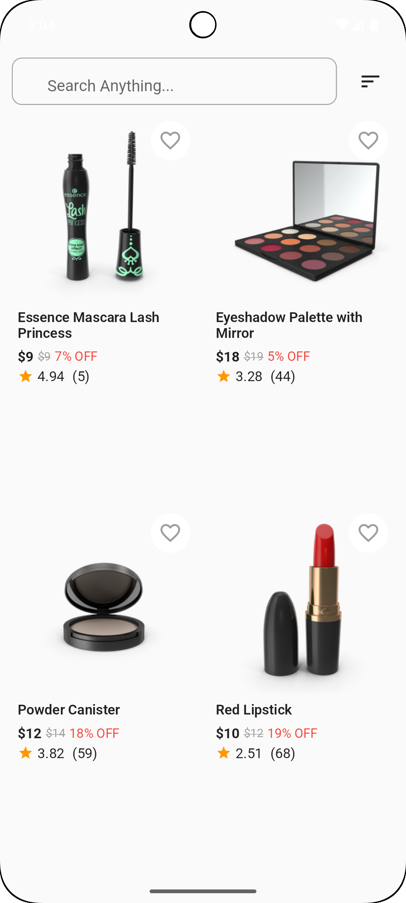
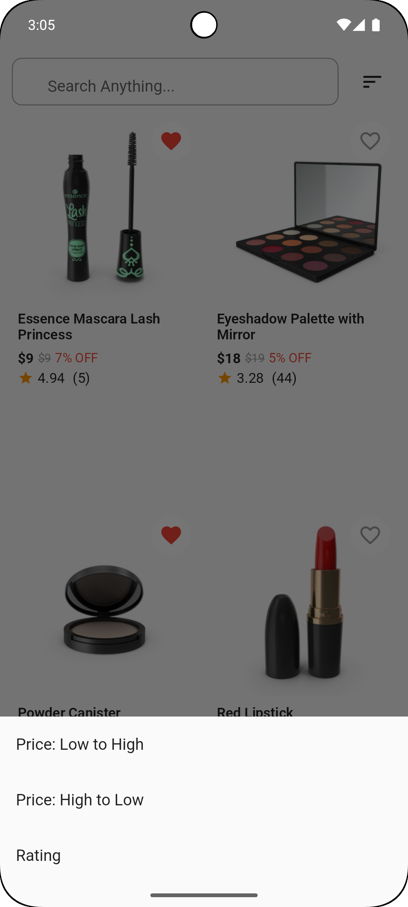
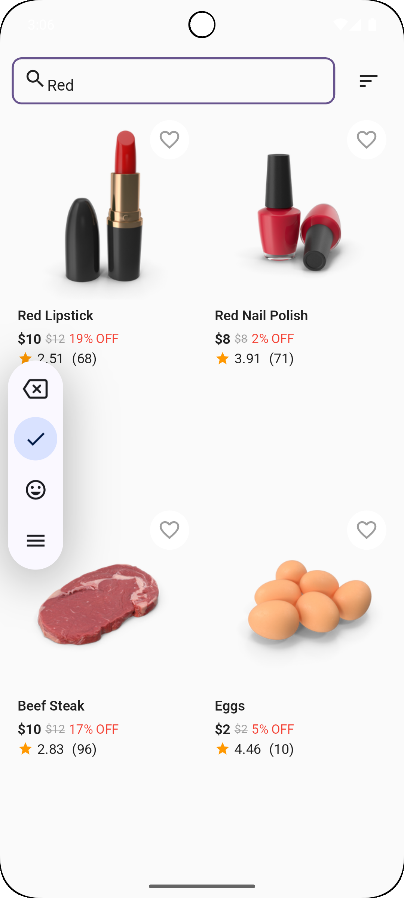
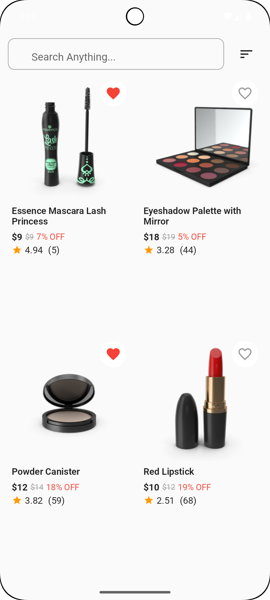

# 🛍️ E-Commerce Product Listing App – Flutter

A clean, scalable Flutter application built using **Feature-first Modular Architecture** and powered by **Riverpod 2.0** for state management. This app demonstrates essential e-commerce UI and functionality including infinite scroll, product search, sort by criteria, offline-first data loading using Hive, and testing with Flutter’s test suite.

---

## 🧱 Architecture Used

### 📌 Feature-First Modular Architecture

This architecture emphasizes modular separation by **feature**, not by type. Each feature contains its own data, presentation, and provider layers, resulting in:

- Better **scalability**
- Clear **separation of concerns**
- Reusable and isolated **UI & logic**
- Easier **testing** and **team collaboration**

> Example:
features/ └── product/ ├── data/ → models, repository ├── presentation/ → screens, widgets, providers
> 
>
This structure helps scale large apps without code entanglement.

---

## ⚙️ State Management: Riverpod 2.0

Why Riverpod?

- Compile-time safety & auto dispose
- No `BuildContext` required
- Test-friendly
- Scalable for both small & large apps

---

## 📦 Packages Used

| Package            | Purpose                                      |
|--------------------|----------------------------------------------|
| `flutter_riverpod` | State management (Riverpod 2.0)              |
| `dio`              | REST API integration                         |
| `hive`             | Lightweight local NoSQL storage              |
| `hive_flutter`     | Flutter binding for Hive                     |
| `connectivity_plus`| Internet connectivity status detection       |
| `flutter_test`     | Unit and widget testing                      |

---

## 🎯 Features Implemented

| Feature                          | Status  |
|----------------------------------|---------|
| Product list with API            | ✅ Done |
| Infinite scroll pagination       | ✅ Done |
| Search with debounce             | ✅ Done |
| Sort by price/rating             | ✅ Done |
| BottomSheet for sorting options  | ✅ Done |
| Offline cache with Hive          | ✅ Done |
| Snackbar for offline mode        | ✅ Done |
| Favorite button (local toggle)   | ✅ Done |
| Unit & widget testing            | ✅ Done |
| Clean project structure          | ✅ Done |

---

## 🚧 Not Implemented (Optional Scope)

| Feature                          | Reason                        |
|----------------------------------|-------------------------------|
| Persisting favorites             | Would require Hive or SQLite |
| Category filtering               | Not part of assignment scope |
| Advanced animations              | Skipped for simplicity        |
| Cart functionality               | Not included in task brief    |

---

## 🧪 Tests Written

| Test Type   | Description                                  | File Path                    |
|-------------|----------------------------------------------|------------------------------|
| Unit Test   | Product sorting logic                        | `test/product_sort_test.dart` |
| Widget Test | ProductCard renders title and price correctly| `test/product_card_test.dart` |

Run all tests:
```bash
flutter test

#Folder Structure Overview
lib/
├── core/
│   ├── network/              → ApiService (Dio wrapper)
│   ├── config/               → base_url, configs
│   ├── constants/            → colors, strings
│   └── utils/                → Network helper (offline check)
├── shared/
│   └── widgets/              → reusable loading/error widgets
├── features/
│   └── product/
│       ├── data/             → models, repository
│       └── presentation/
│           ├── screens/      → Home screen
│           ├── widgets/      → ProductCard, sort sheet
│           └── provider/     → Riverpod providers
└── main.dart

## 📸 Screenshots

| Home Screen | Sort | Search |
|-------------|----------------|------------------|
|  |  |  | 


## 👨‍💻 Author

**Md Marufur Rahman**  
📱 Mobile App Developer  
🔗 [LinkedIn](https://www.linkedin.com/in/dev-marufur-rahman/)  
🌐 [Portfolio](https://devmarufurrahman.xyz/)  
💻 [GitHub](https://github.com/devmarufurrahman)


